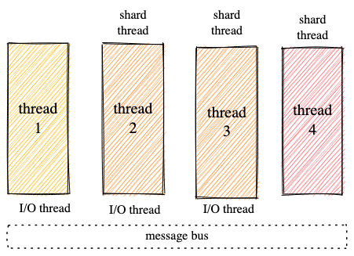
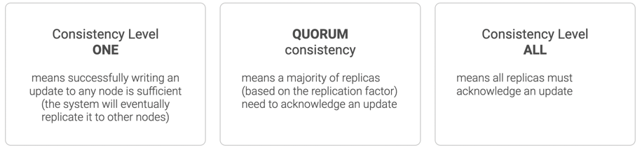

# CAP и реальные базы данных

## Dragonfly

Архитектура системы поверхностно описана в [этом файле](https://github.com/dragonflydb/dragonfly/blob/c49e88899b4d1266574e98f2a146c3fca92f8c4d/docs/df-share-nothing.md
). Основные особенности системы:
1. База данных Dragonfly разработана для вертикального масштабирования. Более того, она запускается на единственном инстансе! 
Такое ограничение сразу отметает свойство *Partition Tolerance*, по очевидным причинам.  
2. Система шардирования. Все данные разбиты на шарды, за каждый шард отвечает отдельный тред.
Внутри каждого треда реализованы *асинхронные* файберы. Таким образом системе не нужны блокировки и синхронизации в пределах одного треда! 
На самом деле это довольно частая практика, например, другая in-memory база данных [Tarantool](https://www.tarantool.io/ru/), 
использует всего один тред для доступа к данным и много I/O тредов, благодаря чему удается существенно уменьшить количество блокировок и синхронизаций.

После того как клиент отправляет запрос на какой-либо I/O тред, этот тред находит, на каком шарде находятся данные, и эффективно 
отправляет запрос ему, после чего возвращает ответ клиенту. Что же значит "эффективно", ведь это параллельные операции между тредами?
Заявляется, что они используют некоторые современные алгоритмы:
> The coordinator serves as a virtualization layer that hides all the complexity of talking to multiple shards. It employs start-of-the-art algorithms to provide atomicity (and strict serializability) semantics for multi-key commands like "mset, mget, and blpop."

Таким образом эта часть системы обеспечивает *Consistency* (Данные хранятся в единственном экземпляре на одном из шардов)
и *Availability* (Почти полное отсутствие блокировок дает нам скорость, а файберы, работающие в рамках одного треда обеспечивают корректность).

Dragonfly - CA база данных.

## ScyllaDB
Архитектура доступности описана на [этой странице](https://www.scylladb.com/product/technology/high-availability/). 
Scylla использует протокол кластеризации *gossip* (Подробнее о нем можно прочитать [тут](https://docs.scylladb.com/stable/kb/gossip)).
Главной идеей протокола является то, что мы выбираем случайные узлы 
(заметим, что Scylla поддерживает репликацию, причем с настраиваемым фактором),
которые общаясь между собой решают, какие данные "валидные". Также в системе нет master-slave иерархий. Репликация и *gossip* дают нам
свойство *Partition Tolerance*, внутренние алгоритмы перераспределяют ресурсы и репликацию в случае отключения узлов. 
Также конкретно *gossip* позволяет добиться высокого *Availability*, ведь нам не нужно ждать, пока на всех репликах применятся изменения (Или нужно?).
На самом деле Scylla - довольно тонко настраиваемая распределенная система. 
На картинке ниже видно, что мы можем понижать *Consistency*, увеличивая *Availability* - левый вариант конфигурации.
А можем дать жесткие ограничения на *Consistency*, но тогда явно проигрывая в *Availability* - правый вариант. 

Но по задумке разработчиков система имеет больший уклон в *Availability*, поэтому алгоритмы и движок скорее оптимизированы под этот сценарий
использования БД. К примеру, на наш запрос могут выпасть разные реплики, на которых разные данные, из-за чего мы получим разные ответы на запрос.

ArenadataDB - AP база данных.

## ArenadataDB

Arenadata - база данные, основанная на системе Greenplum. Сама Greenplum соответствует требованиям ACID
([Статья Arenadata об совместном использовании Greenplum и Сlickhouse](https://arenadata.tech/about/blog/subd-dlya-analitiki-greenplum-ili-clickhouse/#)).
А значит Arenadata соответствует свойству *Consistency*. Также, так как это распределенная система больших данных, то она, очевидно, соответствует *Partition Tolerance*.
Это подтверждается тем, что Greenplum используется в банках, где важна консистентность данных.
Исходя из изложенного, можно предположить, что по теореме CAP система не удовлетворяет требованиям *Availability*.

ArenadataDB - CP база данных.