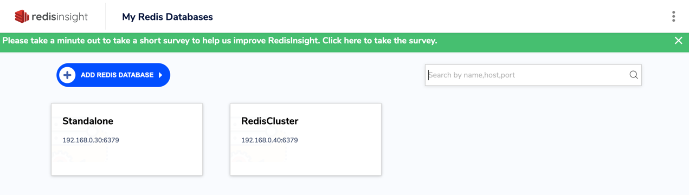

# Redis

### Container

Конфиги для контейнеров находятся в папке `docker.`
```shell
./docker/start_docker.sh
```

Адрес standalone базы из одной реплики: `192.168.0.30:6379`
Адрес master базы из кластера трех реплик: `192.168.0.40:6379`

Чтобы посмотреть состояние баз: [Local Insight](localhost:8001).



Перед прогоном бенчмарков: 
```shell
unzip data/games.zip -d ./data
```

### Benchmarks

Подробный отчет можно посмотреть в [benchmark.ipynb](./benchmark.ipynb).
Как и ожидалось, с подключенной репликацией Redis имеет latency выше.

Но так как задержка с репликацией лишь 5-10%, то это прекрасный результат.