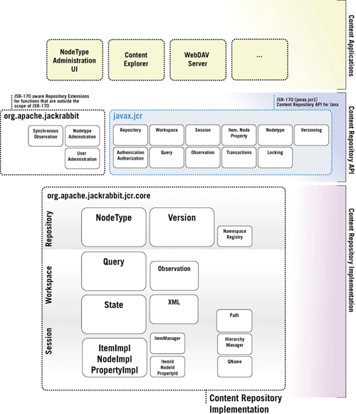

# Apache Jackrabbit

### История

Apache Jackrabbit — это репозиторий контента с открытым исходным кодом на основе Java,
который предоставляет **иерархическую систему хранения данных**.
Проект был инициирован Day Software в 2004 году, а в 2006 году он был передан Apache Software Foundation.

Проект начался с того, что Day Software потребовалось создать репозиторий контента,
который может хранить и управлять огромным количеством структурированного и неструктурированного контента для своих клиентов.
Разработчики Day Software использовали спецификацию Java Content Repository (JCR) в качестве основы для Apache Jackrabbit.
**JCR** — это стандарт, определяющий API Java для доступа к репозиториям контента.

Одной из важных вех в истории Apache Jackrabbit стал выпуск версии 2.0 в 2010 году. В этом выпуске появилось несколько новых функций,
включая улучшенную производительность, поддержку **полнотекстового поиска** и расширенные возможности кластеризации. Еще одним важным выпуском была версия 2.2,
в которой была добавлена поддержка протокола **WebDAV**, что упростило доступ к содержимому, хранящемуся в репозиториях Jackrabbit, из веб-приложений.

### Инструменты взаимодействия

Как уже было указано ранее, Jackrabbit используется для иерархического хранения данных.
Основные инструменты взаимодействия с СУБД:
* **WebDAV**: протокол WebDAV, позволяет веб-клиентам получать доступ и управлять содержимым, хранящимся в репозиториях Jackrabbit.
Библиотека поддерживает операции чтения и записи, позволяя клиентам создавать, обновлять и удалять содержимое. 
Самое важный и популярный метод взаимодействия с СУБД.
* **FileVault**: это инструмент на основе файловой системы, который позволяет разработчикам управлять содержимым в репозиториях Jackrabbit,
как если бы они были файлами в локальной файловой системе.
* **Консоль Oak**: это веб-консоль, предоставляющая графический пользовательский интерфейс для управления репозиториями Jackrabbit Oak.
Консоль позволяет администраторам просматривать репозиторий, создавать и удалять узлы, а также просматривать и изменять свойства узлов.
* **Sling**: это веб-фреймворк, созданный поверх Jackrabbit Oak и предоставляющий интерфейс RESTful для доступа и управления содержимым,
хранящимся в репозиториях Jackrabbit. Sling включает в себя несколько функций, упрощающих разработку веб-приложений,
использующих Jackrabbit, таких, как разрешение ресурсов, обработка запросов и рендеринг контента.

Как итог, можно сказать, что Jackrabbit может использоваться конечным пользователем как файловая система,
которая под капотом поддерживает _транзакции_, _репликацию_ и _высокую доступность_.

**Пример использования пользователем:**


**Пример использования Oak**:
```shell
/jcr:root/oak:index/*[@type='lucene'] option(traversal ok)

select * from [nt:base]
where ischildnode('/oak:index')
order by name()
option(traversal ok)
```

Oak поддерживает SQL-подобные вызовы.

### Внутреннее устройство

Apache Jackrabbit построен на основе API JCR, который определяет стандартный набор интерфейсов для создания, чтения,
обновления и удаления контента в репозитории контента и предоставляет унифицированный способ доступа к контенту,
хранящемуся в различных типах репозиториев.


**Jackrabbit** - это middleware между пользовательским интерфейсом и внутренней реализацией БД.

**Пользовательский интерфейс** - интерфейс, который регулирует обращение конечного пользователя к базе. Примером служит
_WebDAV_, который фактически эмулирует файловую систему.

**Внутренняя реализацией БД** определяет, как именно данных хранятся. Ключевые компоненты реализации: 
_узел_, _сессия_, _запрос_, _путь_. **Драйвера** предоставляют API, с помощью которого тут можно использовать разные БД:
* _Apache Derby_
* _MySQL_
* _PostgreSQL_
* _Microsoft SQL Server_
* _Oracle Database_
* _MongoDB_ 
* _Apache Cassandra_

Непосредственно Jackrabbit контролирует _сессии_, _транзакции_, _локи_, _версионирование_, _шардирирование_ и _репликацию_.

Apache Jackrabbit написана на **Java** и прямое взаимодействие доступно только с помощью кода:
```java
import javax.jcr.GuestCredentials;
import javax.jcr.Repository;
import javax.jcr.Session; 
import org.apache.jackrabbit.commons.JcrUtils;
/** 
* First hop example. Logs in to a content repository and prints a 
* status message. 
*/ 
public class FirstHop { 
    /** 
    * The main entry point of the example application. 
    * 
    * @param args command line arguments (ignored) 
    * @throws Exception if an error occurs 
    */ 
    public static void main(String[] args) throws Exception { 
        Repository repository = JcrUtils.getRepository();
        Session session = repository.login(new GuestCredentials());
        try { 
            String user = session.getUserID(); 
            String name = repository.getDescriptor(Repository.REP_NAME_DESC); 
            System.out.println( 
            "Logged in as " + user + " to a " + name + " repository."); 
        } finally { 
            session.logout(); 
        } 
    } 
} 
```

### Индексация

Индексирование — важная функция Apache Jackrabbit, позволяющая быстро и эффективно искать и извлекать контент.
Когда контент добавляется в репозиторий, Jackrabbit автоматически индексирует его, чтобы его можно было быстро найти и получить позже.
Jackrabbit поддерживает различные типы индексации:
* **Индексирование свойств**: Jackrabbit поддерживает индексирование отдельных свойств в элементах контента.
Например, если элемент контента имеет свойство «заголовок», Jackrabbit может проиндексировать это свойство.
Когда выполняется поиск, включающий свойство «заголовок», Jackrabbit будет использовать этот индекс для быстрого поиска.
* **Полнотекстовое индексирование**: Jackrabbit поддерживает полнотекстовое индексирование, что позволяет искать контент на основе содержащегося в нем текста.
Когда контент добавляется в репозиторий, Jackrabbit анализирует текст и создает указатель слов и фраз, которые в нем встречаются.
* **Двоичное индексирование**: Jackrabbit поддерживает индексирование двоичных данных, таких как изображения или документы.
Когда двоичный файл добавляется в репозиторий, Jackrabbit анализирует метаданные файла и создает индекс его атрибутов,
таких как имя файла, автор или дата создания.

Пример использования поиска, который задействует индекс (используется _oak-run_):
```shell
explain select * from [nt:base] where new_property = 'foo'
```
```shell
... 
+ Traversing index new_propertyIndex using constraint new_property:foo 
+ Fetching nodes using filter: (path is descendant of [/]) 
+ Filter returned 1 hits 
...

```

### Транзакции

Транзакции доступны только посредством обращения к базе в коде:
```java
Session session = repository.login();

try {
    session.getWorkspace().getTransactionManager().begin();

        // perform multiple operations within the transaction
        Node node1 = session.getRootNode().addNode("node1");
        node1.setProperty("prop1", "value1");

        Node node2 = session.getRootNode().addNode("node2");
        node2.setProperty("prop2", "value2");

        // commit the transaction
        session.getWorkspace().getTransactionManager().commit();
} catch (Exception e) {
        // rollback the transaction if an exception is thrown
        session.getWorkspace().getTransactionManager().rollback();
} finally {
        session.logout();
}
```

### Шардирование

В Jackrabbit хранилище данных отвечает за хранение двоичных данных, связанных с узлами в репозитории.
По умолчанию Jackrabbit использует хранилище данных файловой системы, в котором хранятся двоичные данные в файловой системе хост-компьютера.
Чтобы разделить хранилище данных, вы можете разделить файловую систему на несколько компьютеров,
при этом каждый компьютер будет отвечать за хранение подмножества данных.

Таким способом мы можем шардировать определенные узлы файловой системы: каждой папке может соответствовать свой
хост.

Кроме того, вы можете использовать хранилище данных базы данных, такое как Apache Derby, MySQL или PostgreSQL.
В этом случае вы можете сегментировать базу данных, разделив данные на несколько экземпляров базы данных.

## Использование

_TLDR_\
Эта СУБД просто ужасна.

### Конфигурация

Конфиг Jackrabbit представляет собой XML файл. Нет, это не шутка:
```xml
<!DOCTYPE Repository
        PUBLIC "-//The Apache Software Foundation//DTD Jackrabbit 2.0//EN"
        "http://jackrabbit.apache.org/dtd/repository-2.0.dtd">

<!-- Example Repository Configuration File
     Used by
     - org.apache.jackrabbit.core.config.RepositoryConfigTest.java
     -
-->
<Repository>
    <!--
        virtual file system where the repository stores global state
        (e.g. registered namespaces, custom node types, etc.)
    -->
    <FileSystem class="org.apache.jackrabbit.core.fs.local.LocalFileSystem">
        <param name="path" value="${rep.home}/repository"/>
    </FileSystem>

    <!--
        data store configuration
    -->
    <DataStore class="org.apache.jackrabbit.core.data.FileDataStore"/>

    <!--
        security configuration
    -->
    <Security appName="Jackrabbit">
        <!--
            security manager:
            class: FQN of class implementing the JackrabbitSecurityManager interface
        -->
        <SecurityManager class="org.apache.jackrabbit.core.DefaultSecurityManager" workspaceName="security">
            <!--
            workspace access:
            class: FQN of class implementing the WorkspaceAccessManager interface
            -->
            <!-- <WorkspaceAccessManager class="..."/> -->
            <!-- <param name="config" value="${rep.home}/security.xml"/> -->
        </SecurityManager>

        <!--
            access manager:
            class: FQN of class implementing the AccessManager interface
        -->
        <AccessManager class="org.apache.jackrabbit.core.security.DefaultAccessManager">
            <!-- <param name="config" value="${rep.home}/access.xml"/> -->
        </AccessManager>

        <LoginModule class="org.apache.jackrabbit.core.security.authentication.DefaultLoginModule">
            <!--
               anonymous user name ('anonymous' is the default value)
             -->
            <param name="anonymousId" value="anonymous"/>
            <!--
               administrator user id (default value if param is missing is 'admin')
             -->
            <param name="adminId" value="admin"/>
        </LoginModule>
    </Security>

    <!--
        location of workspaces root directory and name of default workspace
    -->
    <Workspaces rootPath="${rep.home}/workspaces" defaultWorkspace="default"/>
    <!--
        workspace configuration template:
        used to create the initial workspace if there's no workspace yet
    -->
    <Workspace name="${wsp.name}">
        <!--
            virtual file system of the workspace:
            class: FQN of class implementing the FileSystem interface
        -->
        <FileSystem class="org.apache.jackrabbit.core.fs.local.LocalFileSystem">
            <param name="path" value="${wsp.home}"/>
        </FileSystem>
        <!--
            persistence manager of the workspace:
            class: FQN of class implementing the PersistenceManager interface
        -->
        <PersistenceManager class="org.apache.jackrabbit.core.persistence.pool.MySqlPersistenceManager">
            <param name="driver" value="com.mysql.jdbc.Driver"/>
            <param name="url" value="jdbc:mysql://localhost:3306/db"/>
            <param name="user" value="root"/>
            <param name="password" value="root"/>         <!-- use your database user's password -->
            <param name="schema" value="mysql"/>
            <param name="schemaObjectPrefix" value="pm_ws_${wsp.name}_"/>
        </PersistenceManager>
        <!--
            Search index and the file system it uses.
            class: FQN of class implementing the QueryHandler interface
        -->
        <SearchIndex class="org.apache.jackrabbit.core.query.lucene.SearchIndex">
            <param name="path" value="${wsp.home}/index"/>
            <param name="supportHighlighting" value="true"/>
        </SearchIndex>
    </Workspace>

    <!--
        Configures the versioning
    -->
    <Versioning rootPath="${rep.home}/version">
        <!--
            Configures the filesystem to use for versioning for the respective
            persistence manager
        -->
        <FileSystem class="org.apache.jackrabbit.core.fs.local.LocalFileSystem">
            <param name="path" value="${rep.home}/version"/>
        </FileSystem>

        <!--
            Configures the persistence manager to be used for persisting version state.
            Please note that the current versioning implementation is based on
            a 'normal' persistence manager, but this could change in future
            implementations.
        -->
        <PersistenceManager class="org.apache.jackrabbit.core.persistence.pool.MySqlPersistenceManager">
            <param name="driver" value="com.mysql.jdbc.Driver"/>
            <param name="url" value="jdbc:mysql://localhost:3306/db"/>
            <param name="user" value="root"/>
            <param name="password" value="root"/>             <!-- use your database user's password -->
            <param name="schema" value="mysql"/>
            <param name="schemaObjectPrefix" value="pm_vs_"/>
        </PersistenceManager>
    </Versioning>

    <!--
        Search index for content that is shared repository wide
        (/jcr:system tree, contains mainly versions)
    -->
    <SearchIndex class="org.apache.jackrabbit.core.query.lucene.SearchIndex">
        <param name="path" value="${rep.home}/repository/index"/>
        <param name="supportHighlighting" value="true"/>
    </SearchIndex>
```
Тут указывается следующее:
* Маппинг папок хоста и СУБД
* Security and Access managers отвечают за пользователей, доступы и пароли.
* Тут же указываются какой драйвер будет использоваться для конкретного workspace (аналог namespace) - MySQL, Postgresql и тд

На официальном ресурсе есть [гайд](https://jackrabbit.apache.org/jcr/first-hops.html).
Но все взаимодействие и **почти все примеры показаны на Java**. 

Казалось бы, БД делает ставку на кроссплатформенность и удобство (или потому что в Apache пишут только на Java).
Но ни одна Standalone сборка с сайта не встала нормально на _MacOS M1_. 
Постоянно вылетали исключения, которые ничего информативного не дали. 

**Решение:** Docker

Есть неофициальный докер-образ Jackrabbit: [образ](https://hub.docker.com/r/gluufederation/jackrabbit).\
Для сравнения:\
**Jackrabbit** docker pulls ~ 100 тыс.
**Cassandra** docker pulls ~ 100 млн.

### Документация

Документация просто ужасна, голый html, никакого индексирования по компонентам.
В добавок постоянные TODO на важных страницах:


### Кто использует

Коммьюнити вокруг этой СУБД отсутствует. В интернете советуют использоваться любые другие альтернативы
(MongoDB, Cassandra), но не прикасаться к этой БД.\
Однако некоторые компании и организации все равно используют Apache Jackrabbit (полагаю, это называется легаси):
* **Adobe**: Adobe использует Apache Jackrabbit в качестве репозитория контента для хранения и управления цифровыми активами, такими как изображения и видео.
* **Европейский институт биоинформатики**: Европейский институт биоинформатики использует Jackrabbit в качестве серверной части для своего редактора онтологий ChEBI, который используется для управления и редактирования химических объектов.
* **Федеральное авиационное управление США**: FAA использует Apache Jackrabbit как часть своей системы управления корпоративным контентом для управления документами и другим контентом, связанным с управлением воздушным движением.
* **BBC**: BBC использует Jackrabbit как часть своей системы управления контентом для управления цифровым контентом на своих различных веб-сайтах и в приложениях.
* **Atlassian**: Atlassian, компания, разработавшая популярные инструменты для совместной работы, такие как Jira и Confluence, использует Jackrabbit в качестве серверной части для своего вики-приложения Confluence.
 
## Итог

Jackrabbit — это мощный репозиторий контента, который обеспечивает уровень абстрактного доступа к данным,
что делает его полезным инструментом для управления и хранения структурированных данных.
Однако, хотя у Jackrabbit может быть хорошая основная идея, есть несколько недостатков,
которые делают его менее желательным по сравнению с другими вариантами.

Во-первых, документация по Jackrabbit часто запутана и сложна в навигации, что может затруднить пользователям начало работы и эффективное использование продукта.
Кроме того, сообщество Jackrabbit невелико и не активно, как некоторые другие проекты с открытым исходным кодом, а это означает, что пользователи могут не иметь доступа к такой поддержке или ресурсам,
как при других вариантах.

Кроме того, может быть не лучшим выбором для всех случаев использования. Например, если вы хотите хранить и управлять неструктурированными данными или большими объемами данных,
вам может быть лучше использовать базу данных NoSQL, такую как MongoDB или Cassandra.

В целом, хотя у Jackrabbit могут быть свои преимущества, проблемы с документацией, поддержкой сообщества
и пригодностью для определенных вариантов использования могут сделать его менее привлекательным по сравнению с другими вариантами.